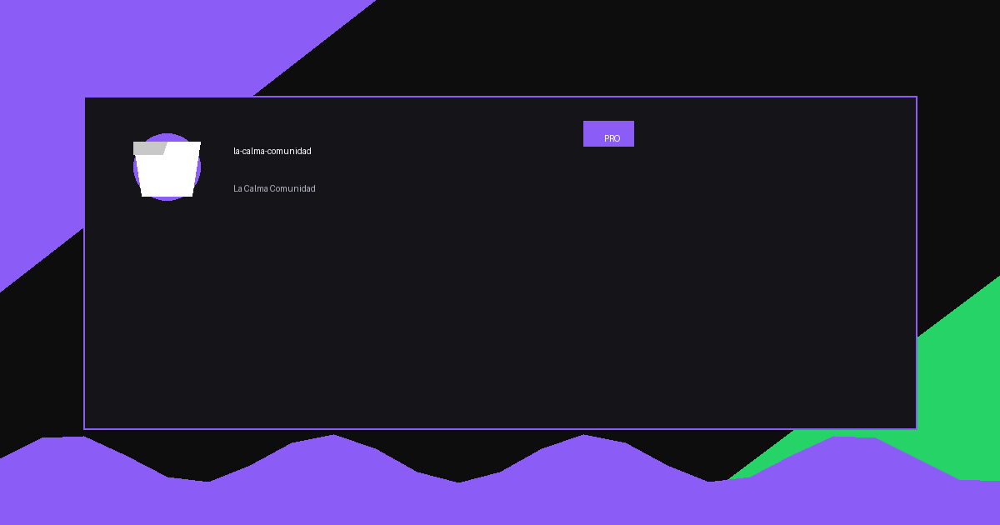
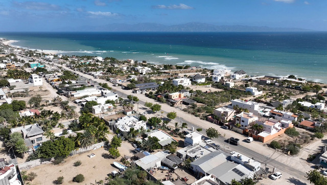

# La Calma Comunidad - Landing Page Premium
<p align="center">
  
</p>




<div align="center">


**Landing page premium en modo oscuro** para desarrollo inmobiliario de lotes exclusivos en La Ventana, Baja California Sur, México.

*Protegiendo su vista, asegurando su futuro.*

</div>

---

## Tabla de Contenidos

- [Descripción](#descripción)
- [Producto](#producto)
- [Tecnologías](#tecnologías)
- [Estructura](#estructura)
- [Secciones](#secciones)
- [Prompts](#prompts)
- [Logs de Versiones](#logs-de-versiones)
- [Configuración](#configuración)
- [Deployment](#deployment)
- [SEO](#seo)
- [Personalización](#personalización)
- [Roadmap](#roadmap)
- [Créditos](#créditos)

---

## Descripción

**La Calma Comunidad** es un landing page premium de alto impacto para un desarrollo inmobiliario exclusivo en La Ventana, Baja California Sur, México.

El sitio web presenta **5 lotes premium de 1,500 m²** con vistas panorámicas al Mar de Cortés, destacando la exclusividad, privacidad y plusvalía del desarrollo.

### Propuesta de Valor

| Aspecto | Descripción |
|---------|-------------|
| **Nombre del Proyecto** | La Calma Comunidad |
| **Sector** | Real Estate / Inmobiliario Premium |
| **Tipo de Negocio** | Desarrollo exclusivo de baja densidad |
| **Tagline** | "Protegiendo su vista, asegurando su futuro" |
| **Color Principal** | Azul Corporativo (#003366) |
| **Color Acento** | Naranja/Dorado (#FF9900) |
| **Ubicación** | La Ventana, BCS, México |
| **Total de Lotes** | 5 unidades |

### Diferenciadores Clave

- ✅ **Baja Densidad** - Solo 5 propietarios
- ✅ **Vistas Garantizadas** - Protección por topografía
- ✅ **Acceso Privado** - 13.27 metros de amplitud
- ✅ **Gran Formato** - 1,500 m² por lote
- ✅ **Plusvalía** - Zona en crecimiento controlado

---

## Producto

### Especificaciones de los Lotes

| Lote | Superficie | Características | Estado |
|------|-----------|-----------------|--------|
| Lote 1 | 1,500 m² | Ubicación Preferente, vistas frontales 180° | Disponible |
| Lote 2 | 1,500 m² | Acceso Directo desde vialidad interna | Disponible |
| Lote 3 | 1,500 m² | Zona Central del desarrollo | Disponible |
| Lote 4 | 1,500 m² | Mayor Elevación relativa | Disponible |
| Lote 5 | 1,505.37 m² | Lote de Remate, geometría extendida | Últimas unidades |

### Precios

| Concepto | Valor |
|----------|-------|
| **Precio Base** | $85,000 USD |
| **Lote 5 (Remate)** | $87,000 USD |
| **Precio por m²** | $56.60 USD |
| **Financiamiento** | Hasta 12 meses sin intereses |
| **Enganche** | Desde 20% |

### Características del Desarrollo

- Acceso privado de **13.27 metros** de ancho
- Vialidad interna de **1,440.19 m²**
- Protección de vistas garantizada por topografía
- Seguridad 24/7
- Factibilidad de servicios (agua y electricidad)
- Sistema biodigestor para aguas residuales (opcional)

---

## Tecnologías

Este proyecto fue desarrollado utilizando:

| Tecnología | Uso | Versión/Detalles |
|------------|-----|------------------|
| **HTML5** | Estructura semántica | Estándar moderno con meta tags completos |
| **Tailwind CSS** | Framework de estilos | v3.x via CDN |
| **JavaScript** | Interactividad | Vanilla JS, Intersection Observer |
| **Google Fonts** | Tipografía | Plus Jakarta Sans (display), Inter (body) |
| **Font Awesome** | Iconografía | v6.4.0 |
| **Google Translate** | Traducción | ES/EN/PT/FR/DE |
| **Google Maps** | Ubicación | Embed API |

### Detalle de Tecnologías

#### Tailwind CSS (via CDN)

```html
<script src="https://cdn.tailwindcss.com"></script>
```

#### Google Fonts Integradas

```html
<link href="https://fonts.googleapis.com/css2?family=Plus+Jakarta+Sans:wght@400;500;600;700;800&family=Inter:wght@400;500;600&display=swap" rel="stylesheet">
```

---

## Estructura

### Arquitectura del Proyecto

```
la-calma-comunidad/
├── index.html          # Archivo principal del sitio
├── README.md           # Documentación del proyecto
└── images/             # Recursos de imagen
    ├── vista-general.jpg       # Vista principal del desarrollo
    ├── division-lotes.jpg      # División de lotes
    ├── vista-cenital.jpg       # Vista cenital aérea
    ├── vista-izquierda.jpg     # Vista lateral izquierda
    ├── vista-derecha.jpg      # Vista lateral derecha
    ├── drone-1.jpg            # Fotografía aérea 1
    ├── drone-2.jpg            # Fotografía aérea 2
    └── drone-3.jpg            # Fotografía aérea 3
```

---

## Secciones

El landing page incluye **13 secciones** documentadas a continuación:

### 1. Navbar (Navegación)

| Atributo | Detalle |
|----------|---------|
| **Tipo** | Fixed/Sticky |
| **Efecto** | Blur + backdrop al hacer scroll |
| **Elementos** | Logo, Links, Botón Cotizar, Menú móvil |
| **Responsive** | Hamburger menu en móvil |

### 2. Hero Section

| Atributo | Detalle |
|----------|---------|
| **Elementos** | Badge, Título con glow, Subtítulo, CTAs, Stats animados |
| **Visual** | Imagen con overlay y glass card de ubicación |
| **Stats** | 5 Lotes, 1,500m², 13m Acceso |
| **CTAs** | Agendar Visita, Ver Galería |

### 3. Social Proof

| Atributo | Detalle |
|----------|---------|
| **Métricas** | 100% Vistas, 24 Min, $85K, 5★ Zona |
| **Estilo** | Grid responsivo con contadores animados |

### 4. Master Plan (Flip Cards)

| Atributo | Detalle |
|----------|---------|
| **Tipo** | Flip Cards 3D interactivas |
| **Lotes** | 5 cards con información detallada |
| **Frente** | Imagen + título + ubicación |
| **Reverso** | Glassmorphism con descripción + features |
| **Interacción** | Hover en desktop |

### 5. Acceso Privado

| Atributo | Detalle |
|----------|---------|
| **Info** | 13.27m ancho, 1,440m² superficie, 24/7 seguridad |
| **Estilo** | Glass card con iconos |

### 6. Galería

| Atributo | Detalle |
|----------|---------|
| **Imágenes** | 5 fotos del desarrollo |
| **Layout** | Grid asimétrico con efecto hover zoom |
| **Estilo** | Rounded corners, sombras |

### 7. Características

| Atributo | Detalle |
|----------|---------|
| **Features** | Privacidad, Vistas, Plusvalía, Ubicación |
| **Estilo** | Glass cards con iconos SVG |

### 8. Análisis FODA

| Atributo | Detalle |
|----------|---------|
| **Cuadrantes** | Fortalezas, Oportunidades, Debilidades, Amenazas |
| **Estilo** | Cards con borde superior de color |

### 9. Ubicación

| Atributo | Detalle |
|----------|---------|
| **Mapa** | Google Maps embebido |
| **POIs** | Playa, The Strip, Aeropuerto, Servicios |
| **Estilo** | Grid 2 columnas |

### 10. Precios

| Atributo | Detalle |
|----------|---------|
| **Planes** | Precio Base, Lote 5 Remate, Financiamiento |
| **Estilo** | Cards con badge "Más Popular" |
| **Features** | Lista de beneficios |

### 11. FAQ

| Atributo | Detalle |
|----------|---------|
| **Tipo** | Accordion interactivo |
| **Preguntas** | 5 items |
| **Estilo** | Glass cards |

### 12. Contacto

| Atributo | Detalle |
|----------|---------|
| **Info** | WhatsApp, Email, Ubicación |
| **Formulario** | Nombre, Email, Teléfono, Lote, Mensaje |
| **Estilo** | Grid 2 columnas |

### 13. CTA Final + Footer

| Atributo | Detalle |
|----------|---------|
| **CTA** | Título + Botón con glow pulsante |
| **Footer** | Brand, Enlaces, Legal, Copyright |

---

## Prompts

### Prompt Original de Creación

```
Crea una landing page premium dark mode para "La Calma Comunidad", 
un desarrollo inmobiliario de lotes premium en La Ventana, BCS, México.

Requisitos:
- Dark mode premium con estética luxury
- Color primario: Azul #003366
- Color acento: Naranja #FF9900
- Flip cards para mostrar los 5 lotes
- Sistema de traducción ES/EN
- Incluye todas las secciones de un landing page Inmobiliario
- Animaciones y efectos visuales premium
- Responsive design
- Google Maps integrado
- Formulario de contacto funcional
```

### Análisis del Prompt

| Componente | Implementación |
|------------|----------------|
| **Modo Oscuro** | ✅ Fondo negro (#000000) con acentos oscuros |
| **Color Azul** | ✅ Sistema completo de colores en Tailwind |
| **Color Naranja** | ✅ Acentos y CTAs |
| **Flip Cards** | ✅ Transform 3D con rotateY |
| **Partículas** | ✅ Sistema con 8 partículas flotantes |
| **Navbar** | ✅ Position fixed + backdrop-filter blur |
| **Contadores** | ✅ Intersection Observer + animación JS |
| **Glassmorphism** | ✅ backdrop-filter + bordes semi-transparentes |
| **Google Maps** | ✅ Embed iframe |
| **Formulario** | ✅ Validación JS |

---

## Logs de Versiones

### v1.0.0 (06 Abril 2026)

**Fecha:** 06 Abril 2026  
**Tipo:** Initial Release

#### Cambios Implementados

| Cambio | Descripción |
|--------|-------------|
| ✅ | Creación del proyecto inicial |
| ✅ | Estructura HTML completa con Tailwind CSS |
| ✅ | Implementación de modo oscuro premium |
| ✅ | Paleta de colores corporativa |
| ✅ | Hero section con estadísticas animadas |
| ✅ | Flip cards para lotes con efectos 3D |
| ✅ | Galería de imágenes con hover effects |
| ✅ | Sección FODA con glassmorphism |
| ✅ | Mapa de Google Maps embebido |
| ✅ | Formulario de contacto funcional |
| ✅ | Sistema de traducción Google Translate |
| ✅ | Animaciones de scroll (Intersection Observer) |
| ✅ | Contadores animados |
| ✅ | Menú móvil responsive |
| ✅ | Final CTA con efecto glow pulsante |
| ✅ | Documentación README completa |
| ✅ | Subida a GitHub |
| ✅ | GitHub Pages habilitado |

---

## Configuración

### Variables Editables

El sitio utiliza Tailwind CSS via CDN. Para personalizar:

```javascript
tailwind.config = {
    theme: {
        extend: {
            colors: {
                'primary': '#003366',      // Azul corporativo
                'accent': '#FF9900',        // Naranja/Dorado
                'bg-primary': '#000000',   // Fondo negro
                'bg-secondary': '#09090B',   // Fondo secundario
                'bg-tertiary': '#18181B',   // Cards
            }
        }
    }
}
```

### Personalización de Contenido

Para cambiar textos, edita directamente en `index.html`:

```html
<!-- Título del sitio -->
<title>Tu Título Aquí</title>

<!-- Descripción meta -->
<meta name="description" content="Tu descripción aquí">
```

### Cambiar Imágenes

Reemplaza las imágenes en la carpeta `/images/` manteniendo los nombres:
- `vista-general.jpg` - Imagen hero principal
- `division-lotes.jpg` - Master plan
- `vista-cenital.jpg` - Vista aérea
- `drone-*.jpg` - Fotografías de dron

### Actualizar Precios

Busca en `index.html`:
```html
<div class="text-5xl font-bold text-accent">$85,000</div>
```

---

## Deployment

### GitHub Pages (Recomendado)

1. **Crear repositorio en GitHub:**
   ```bash
   git init
   git add .
   git commit -m "Initial commit - La Calma Comunidad"
   git branch -M main
   git remote add origin https://github.com/TU_USUARIO/la-calma-comunidad.git
   git push -u origin main
   ```

2. **Activar GitHub Pages:**
   - Ve a Settings > Pages
   - Source: Deploy from a branch
   - Branch: main / (root)
   - Save

3. **Tu sitio estará disponible en:**
   `https://TU_USUARIO.github.io/la-calma-comunidad/`

### Vercel

```bash
npm i -g vercel
vercel
```

### Netlify

Arrastra la carpeta del proyecto a [app.netlify.com](https://app.netlify.com)

---

## SEO

### Meta Tags Implementados

```html
<!-- Primary Meta Tags -->
<title>La Calma Comunidad | Lotes Premium en La Ventana, BCS</title>
<meta name="description" content="La Calma Comunidad - Desarrollo exclusivo de 5 lotes premium de 1,500 m² con vistas panorámicas al Mar de Cortés.">
<meta name="keywords" content="La Calma, lotes, La Ventana, BCS, real estate, Mexico, premium lots, Mar de Cortes">

<!-- Open Graph -->
<meta property="og:title" content="La Calma Comunidad | Lotes Premium en La Ventana">
<meta property="og:description" content="Desarrollo exclusivo de 5 lotes premium de 1,500 m² con vistas panorámicas al Mar de Cortés.">
<meta property="og:type" content="website">
<meta property="og:image" content="images/vista-general.jpg">

<!-- Twitter Card -->
<meta name="twitter:card" content="summary_large_image">
<meta name="twitter:title" content="La Calma Comunidad | Lotes Premium">
<meta name="twitter:description" content="5 lotes premium de 1,500 m² con vistas al Mar de Cortés">
```

### Mejoras SEO Sugeridas

1. **Crear og-image.jpg** (1200x630px) con screenshot de la landing
2. **Sitemap.xml** para indexing
3. **robots.txt** para control de crawling
4. **Schema.org** markup para negocio local
5. **Canonical URL** para evitar duplicados

---

## Personalización

### Guía para Colores

| Color | Valor | Uso |
|-------|-------|-----|
| Azul Primario | `#003366` | Fondos, headers |
| Naranja Acento | `#FF9900` | CTAs, highlights |
| Negro | `#000000` | Fondo principal |
| Gris Oscuro | `#09090B` | Fondo secundario |

#### Cambiar Color Principal

1. Editar `index.html`
2. Modificar el objeto `tailwind.config`
3. Cambiar los valores hex de los colores

```javascript
// Azul alternativo: #1E40AF
// Verde: #166534
// Rojo: #991B1B
```

### Agregar Testimonios

Agregar en la sección de testimonios:

```html
<div class="testimonio-card glass-card">
    <div class="testimonio-stars">★★★★★</div>
    <p class="testimonio-text">"Tu testimonio aquí"</p>
    <div class="testimonio-author">
        <div class="author-avatar">👤</div>
        <div class="author-info">
            <span class="author-name">Nombre</span>
            <span class="author-role">Cargo, Empresa</span>
        </div>
    </div>
</div>
```

### Agregar FAQ

```html
<details class="glass-card p-6 group">
    <summary class="font-bold cursor-pointer flex justify-between items-center">
        Tu pregunta
        <svg class="w-5 h-5 text-accent...">...</svg>
    </summary>
    <p class="mt-4 text-text-secondary">Tu respuesta</p>
</details>
```

---

## Roadmap

### Fase 1: MVP ✅
- [x] Landing page estática
- [x] Diseño responsive
- [x] Animaciones básicas
- [x] Formulario de contacto

### Fase 2: Interactividad ✅
- [x] Flip cards 3D
- [x] Contadores animados
- [x] Menú móvil
- [x] Traducción multilingual

### Fase 3: Optimización 🚧
- [ ] Lazy loading de imágenes
- [ ] Optimización de Core Web Vitals
- [ ] PWA support
- [ ] Modo offline

### Fase 4: Features Avanzadas
- [ ] Blog de noticias del desarrollo
- [ ] Calculadora de financiamiento interactiva
- [ ] Tour virtual 360°
- [ ] Chatbot de WhatsApp integrado

---

## Créditos

### Desarrollador

<div align="center">

**OSCAR OMAR Gómez Peña**  
*EMPRENDEDOR TECNOLÓGICO DIGITAL*

| Contacto | Detalle |
|----------|---------|
| Email | oscaromargp@gmail.com |
| WhatsApp | +52 612 123 4567 |
| Web | [bit.ly/oscaromargp](https://bit.ly/oscaromargp) |
| GitHub | [@oscaromargp](https://github.com/oscaromargp) |

</div>

### Información del Proyecto

| Campo | Detalle |
|-------|---------|
| **Nombre** | La Calma Comunidad |
| **Ubicación** | La Ventana, BCS, México |
| **Tipo** | Desarrollo Inmobiliario Premium |
| **Coordenadas** | 24.0715° N, 109.9999° W |

### Herramientas Utilizadas

| Tecnología | Propósito |
|------------|-----------|
| **Tailwind CSS** | Framework de estilos |
| **Google Fonts** | Tipografía |
| **Font Awesome** | Iconografía |
| **Google Translate** | Traducción |
| **GitHub Pages** | Hosting |

---

## Licencia

© 2026 La Calma Comunidad. Todos los derechos reservados.

Desarrollado con fines comerciales para La Calma Comunidad.

---

<div align="center">

**🌊 Protegiendo su vista, asegurando su futuro 🌅**

*La Calma Comunidad - La Ventana, BCS, México*

**Hecho con ❤️ por [Oscar Omar GP](https://bit.ly/oscaromargp)**

</div>


## 💬 Preguntas y Soporte

<p align="center">
  <a href="https://wa.me/526121077805?text=Hola%20Oscar%2C%20vi%20tu%20proyecto%20en%20GitHub%20y%20quisiera%20preguntarte...">
    
  </a>
</p>


## 💖 Apoya este Proyecto

Si este proyecto te fue útil, considera apoyarlo.

> **Dirección XRP**: `rBthUCndKy3Xbb19Ln4xkZeMwusX9NrYfj`


## 📬 Contacto

<p align="center">
  <strong>Oscar Omar Gómez Peña</strong>
</p>

<p align="center">
  <a href="https://oscaromargp.github.io/Oscaromargp/">
    
  </a>
  <a href="https://github.com/oscaromargp">
    
  </a>
  <a href="https://wa.me/526121077805">
    
  </a>
</p>


## 🙏 Agradecimientos

<p align="center">
  <br/>
  <em>
    "Porque Dios es el que en vosotros produce<br/>
    así el querer como el hacer,<br/>
    por su buena voluntad."
  </em>
  <br/>
  <strong>— Filipenses 2:13</strong>
  <br/><br/>
  Todo lo que aquí existe nació primero como un deseo en el corazón.<br/>
  Cada proyecto, cada línea, cada idea que toma forma —<br/>
  es un regalo de Aquel que nos dio tanto el sueño como la fuerza de alcanzarlo.<br/>
  <strong>A Dios, toda la gloria.</strong>
  <br/>
</p>


## 📸 Capturas de pantalla

<p align="center">
  
</p>

> ¿No puedes ver la imagen? [Ver en el navegador](assets/)

